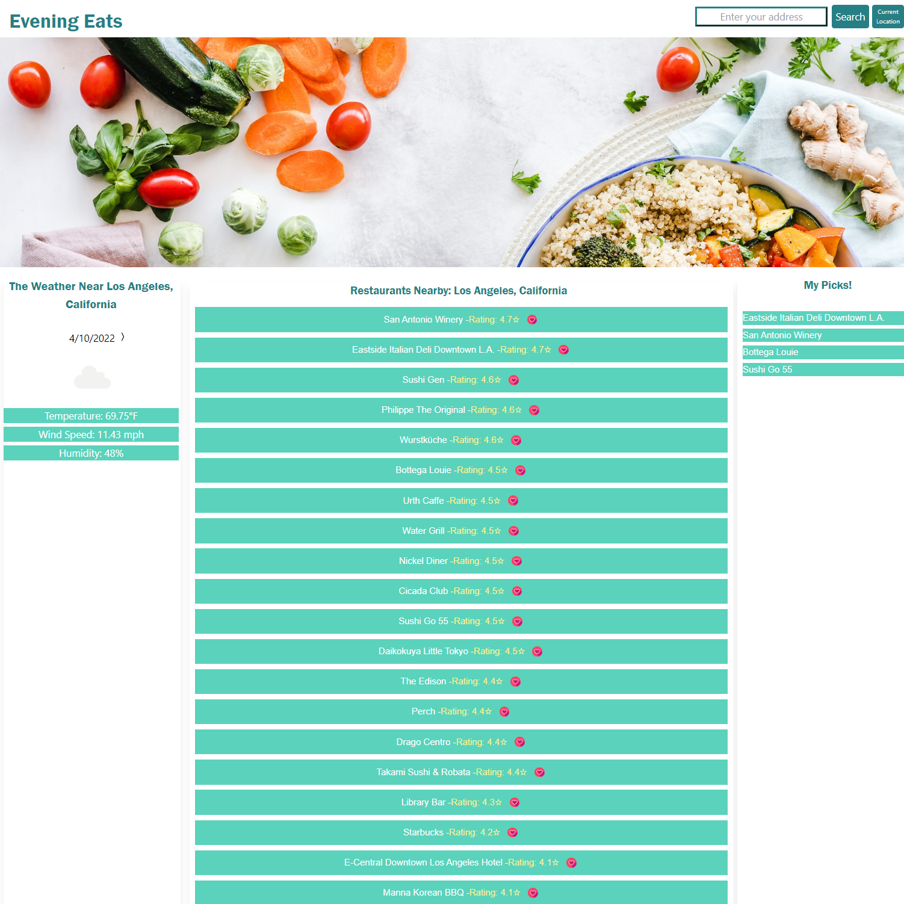

# Restaurant Finder  

## Link
Github Repository: https://github.com/Disha2022/Interactive_Front_End_Project

Deployed Code: https://disha2022.github.io/Interactive_Front_End_Project/

## User Story

1. AS A traveler, I WANT to find restaurants in any location I like SO THAT I can select a restaurant during travel.
2. AS A traveler, I WANT to see weather of a location SO THAT I can plan a trip accordingly.
3. AS A traveler, I WANT to save a restaurant in a list SO THAT I can plan a trip accordingly.

## Purpose 
Create a website that displays a list of nearby restaurant for a given location and its weather conditions.

## Technologys used 
*HTML  
*CSS  
*Tailwind 
*JQuery  
*Open weather one call api  
https://openweathermap.org/api/one-call-api  
*Google maps places library   
https://developers.google.com/maps/documentation/javascript/places  

## Files
1. index.html
2. style.css
3. script.js
4. README.md
## Procedure

1. Initialized html, css and JavaScript files.
2. Added website structure html, css for main header and Jquery html selectors.
3. Added navigator JS code to get user's current location.
4. Added google geocoder API to get user's lat/long from address or city. 
5. Added openweathermap API to show today's weather in user's location. 
6. Added logic to cycle the selected day's weather, up to 7 days in future.
7. Added google-maps-places API to show restaurants and ratings near user's inputted location.
8. Added modal to show when user submits a location not found.
9. Added tailwinds css to show 3 columns on desktop and 1 column in mobile. 
10. Added local storage and button images to save and remove user's selected restuarants in a list. 
11. Updated the styling and added transitions.

## Demo
The following image and Gif demonstrates the application functionality:

## Contributions
Made by Disha Barua, Ethan Cahill, and Christian Foote

